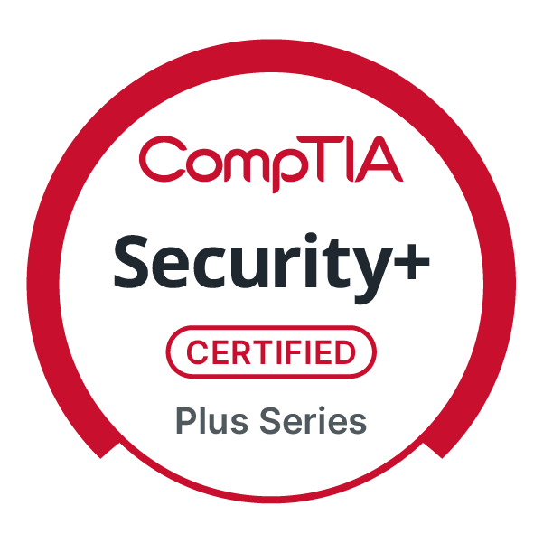

  

# Hello, I'm Abdul 

I am a Cybersecurity Student at Høyskolen Kristiania, currently pursuing a master's degree, with a strong passion for cybersecurity and solving complex technical challenges.

## Objective 🔭

I am eager to start my career in IT, with ambition and a drive to keep seeking continuous learning.

## Skills 

| Skill                                         | Associated Project         |
|-----------------------------------------------|----------------------------|
| Deploy Simple WebApps | <a href="https://github.com/abdulr15352/abdulr15352/tree/main/Cloud/Deploy-Azure-WebApp">Deploy-Azure-WebApp</a>|
| Deploy WebApps And Configure Firewalls | <a href="https://github.com/abdulr15352/abdulr15352/tree/main/Cloud/Deploy-application-firewall">Deploy-application-firewall</a>|
| ESP32 Temperature Sensor with Email alerts | <a href="https://github.com/abdulr15352/abdulr15352/tree/main/IOT/ESP32%20Based%20Webserver%20for%20Temperature%20and%20Humidity%20Measurement%20">ESP32-TEMP-ALERT</a>|
| Programming a Mac address changer | <a href="https://github.com/abdulr15352/abdulr15352/tree/main/Python/mac_changer">MAC_CHANGER</a>|
| Programming a banking application with totp for security | <a href="https://github.com/abdulr15352/Bank_app">Bank_app</a>|
| Running DevOps cycle with note taking app, using github actions | <a href="https://github.com/abdulr15352/mc101-exam">Notes_app</a>|

## Tools 

## Cloud 

    
     

## Operating System

 
     
     

### Network

    

### SIEM

    
    

## Pentesting 

 
     
     
     
     
    
    
    
    

## Certifications

## Projects
- <a href="https://github.com/abdulr15352/abdulr15352/tree/main/Cloud/Deploy-Azure-WebApp">Deploy-Azure-WebApp</a>
- <a href="https://github.com/abdulr15352/abdulr15352/tree/main/Cloud/Deploy-application-firewall">Deploy-application-firewall</a>
- <a href="https://github.com/abdulr15352/abdulr15352/tree/main/IOT/ESP32%20Based%20Webserver%20for%20Temperature%20and%20Humidity%20Measurement%20">ESP32-TEMP-ALERT</a>
- <a href="https://github.com/abdulr15352/abdulr15352/tree/main/Python/mac_changer">MAC_CHANGER</a>
- <a href="https://github.com/abdulr15352/Bank_app">Bank_app</a>
- <a href="https://github.com/abdulr15352/mc101-exam">Notes_app</a>
